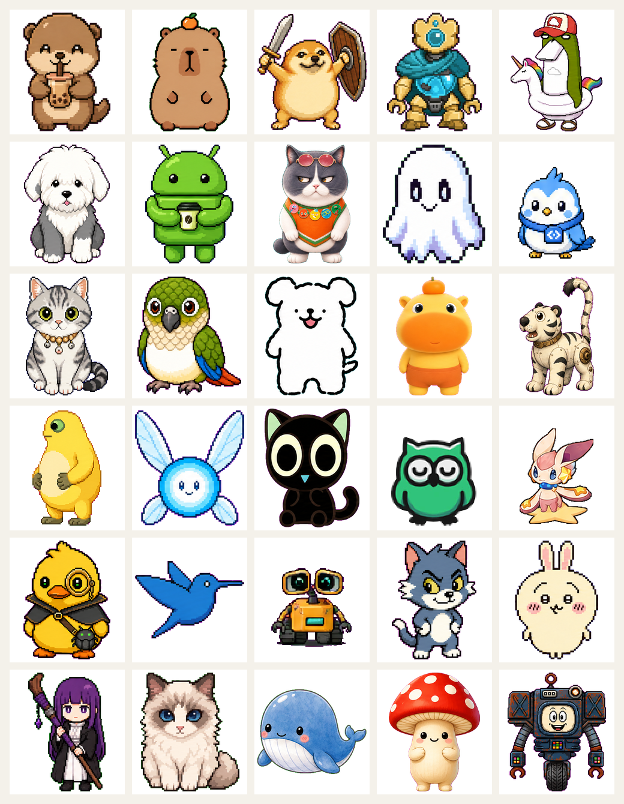
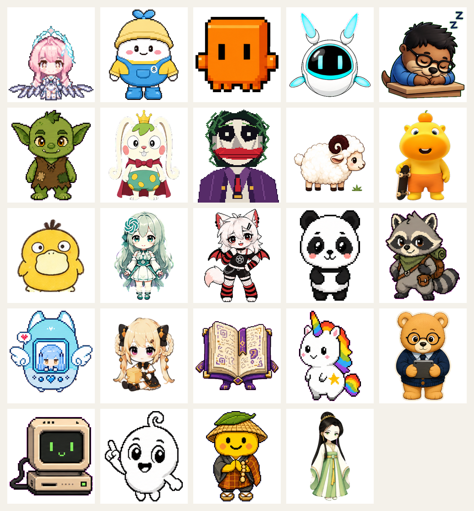

# 九人格 Codex Pet：Background Reference 粗筛

> 2026-07-16 第一轮。目标是确定共享视觉家族和可 Remix 的设计语义，不是挑选可直接复制的角色。

## 本轮覆盖

- 完整枚举 [Petdex](https://petdex.dev) 3,721 条 rich metadata：名称、描述、kind、vibes、tags、颜色、安装、点赞、ZIP 下载和 spritesheet URL。
- 完整检查 [Awesome Codex Pet](https://github.com/legeling/awesome-codex-pet) 106 个目录的分类、标签、许可和图集。
- 视觉抽样 54 个代表：Petdex 30 个，Awesome 24 个，集中覆盖高热度、原创动物、机器人、RPG 职业和混沌角色。

Petdex 当前构成为 `character 1,824 / creature 1,430 / object 467`。角色类常受知名 IP 加成；本轮优先用 creature、object 和原创 mascot 判断真正的形态吸引力。

## 结论：像素 Chibi 公会使魔

九只 Pet 统一采用：

- 2–3 头身，圆脸、短肢、紧凑全身；
- 深色像素描边，两档明暗，最多 6–8 色；
- 角色占 192×208 单格的 70–80%；
- 每只只有一个稳定职业道具；
- 通过耳朵、尾巴、体型、主色区分，不靠复杂服装；
- 表情清楚、友好、略带二次元 RPG 感。

不选软玩具 3D 作为主风格：静态图亲和，但 72 帧容易产生材质和比例漂移。不选半写实 Chibi：细节过载且更容易 uncanny。贴纸风可作为局部轮廓参考，但最终仍统一为像素 Chibi。

## 热度如何使用

先做“亲和力 / 生理安全”硬过滤，再把热度作为粗排主权重：安装量优先，点赞和 ZIP 下载辅助。

- [Boba](https://petdex.dev/pets/boba) — `5,388 installs / 16 likes / 97 ZIP`：最强大众可爱锚点。
- [Tiko](https://petdex.dev/pets/tiko) — `2,868 / 19 / 41`：最强原创机械锚点。
- [Usagi](https://petdex.dev/pets/usagi) — `1,538 / 31 / 37`：圆脸、短肢、极简表情。
- [TestBird](https://petdex.dev/pets/testbird) — `1,317 / 4 / 5`：小尺寸清晰轮廓。
- [Lian](https://petdex.dev/pets/lian-3) — `1,675 / 4 / 3`：高辨识度职业装饰，但只取配色节奏。
- [吉伊](https://petdex.dev/pets/jiyi) — `499 / 14 / 16`：圆脸、软轮廓和小道具。
- [Cinder](https://petdex.dev/pets/cinder) — `376 / 8 / 24`：混沌但不恶心的边界样本。

Doraemon、Shinchan、Pikachu 等高热结果含明显 IP 加成，只证明“轮廓与表情受欢迎”，不进入 Remix 身份参考。

## 全局风格锚点

所有九只都共享这些锚点，而不是每只采用不同画风：

1. **Boba**：比例、圆润度、亲和表情。
2. **Tiko**：技术感、机械构造仍然可爱。
3. **Usagi / 吉伊**：极简面部、短肢、软轮廓。
4. **Rook**：动物底型与 RPG 装备可以共存。
5. **Tiny CRT**：圆角科技界面可以成为脸。
6. **Little Black Mage**：单一帽子或道具即可建立职业辨识度。

Awesome 的统一热度数据不完整。可比较样本中 Chispa 为 `20 likes / 608 views`、Little Black Mage `15 / 237`、Goblin `11 / 198`、Rook `10 / 102`、Tiny CRT `9 / 274`。这些只作为方向证据，不与 Petdex 安装量硬合并。

## 九人格参考池

### Tactician / 蓝图策士

- [Prompt Penguin](https://petdex.dev/pets/prompt-penguin)：卷轴、稳定站姿；`136 installs / 7 ZIP`。
- [Koda](https://petdex.dev/pets/koda)：红熊猫、电脑与工作感。
- [Peri the Owl](https://petdex.dev/pets/peri-the-owl)：猫头鹰、专注、智慧轮廓。
- [Desk Otter](https://github.com/legeling/awesome-codex-pet/tree/main/pets/desk-otter--zihualiu1997)：眼镜水獭、工程工作感。
- [Tiny CRT](https://github.com/legeling/awesome-codex-pet/tree/main/pets/tiny-crt--chochou)：冷静终端脸。

Remix 方向：午夜蓝狐形使魔，短披风，唯一道具为折叠战术板。

### Artificer / 技栈奇械师

- [Tiko](https://petdex.dev/pets/tiko)：原创工具机器人；本型主锚。
- [Nono](https://petdex.dev/pets/nono)：亲和小机器人。
- [Brassprout](https://petdex.dev/pets/brassprout)：黄铜机械与植物软化。
- [CodeNoNo](https://github.com/legeling/awesome-codex-pet/tree/main/pets/codenono--dq02)：圆角白色机器人。
- [Chispa](https://github.com/legeling/awesome-codex-pet/tree/main/pets/chispa--giiilberto-nm)：复古机械、工具手臂。

Remix 方向：琥珀与钢灰方形机器人，大手套，唯一道具为模块扳手；避免 WALL-E 邻近造型。

### Cartographer / 体验绘界师

- [Scoutlet](https://petdex.dev/pets/scoutlet)：帽子、围巾、探索感。
- [Rolling](https://petdex.dev/pets/rolling)：背包和移动轮廓。
- [Goose](https://petdex.dev/pets/goose-default)：navigator 标签、清楚鸟形。
- [Spellbook](https://github.com/legeling/awesome-codex-pet/tree/main/pets/spellbook--seymour)：地图与书页语义。
- [Starcorn](https://github.com/legeling/awesome-codex-pet/tree/main/pets/starcorn--alterhq)：柔和探索、奇幻亲和力。

Remix 方向：青绿长耳兔，侧披风，唯一道具为卷轴地图。

### Weaver / 像素织师

- [Liney](https://petdex.dev/pets/liney)：简洁线稿和亲和表情；`219 installs`。
- [Pixel Panda](https://petdex.dev/pets/pixel-panda)：像素轮廓。
- [Pippa](https://petdex.dev/pets/pippa)：画笔与工具袋语义。
- [Jiji](https://github.com/legeling/awesome-codex-pet/tree/main/pets/jiji--yena)：极简黑猫轮廓。
- [Little Sheep](https://github.com/legeling/awesome-codex-pet/tree/main/pets/little-sheep--mingdong)：柔软材质与少量高光。

Remix 方向：珊瑚与洋红圆猫，丝带形尾巴，唯一道具为像素织笔；避免蜘蛛、破口缝线和人体娃娃感。

### Warden / 热修守望者

- [Moro](https://petdex.dev/pets/moro)：机械白虎幼兽、守护姿态；`340 installs`。
- [Daodun](https://petdex.dev/pets/daodun)：圆狗、盾牌；`693 / 19 likes / 34 ZIP`。
- [Cinder](https://petdex.dev/pets/cinder)：可靠狗形与温和混沌。
- [Teddy](https://github.com/legeling/awesome-codex-pet/tree/main/pets/teddy--danieloleary)：圆厚、拥抱感。
- [Panda](https://github.com/legeling/awesome-codex-pet/tree/main/pets/panda--jason-bai)：稳定、防护、低攻击性。

Remix 方向：森林绿与金色宽体小熊，盾状背甲，唯一道具为补丁盾；去掉剑、尖刺和厚重盔甲。

### Ranger / 故障巡猎者

- [Nightly Fox](https://petdex.dev/pets/nightly-fox)：狐狸、警觉姿态；`90 installs / 7 ZIP`。
- [Naiwa](https://petdex.dev/pets/naiwa)：粉彩 debugger 青蛙。
- [Quacktop](https://petdex.dev/pets/quacktop)：橡皮鸭 debugger；`73 installs`。
- [Rook](https://github.com/legeling/awesome-codex-pet/tree/main/pets/rook--klubbyte)：浣熊、背包、侦察装备。
- [Night Neko](https://github.com/legeling/awesome-codex-pet/tree/main/pets/night-neko--netizenxuan)：尖耳、暗色科技感。

Remix 方向：靛青猞猁，前倾轮廓，唯一道具为故障扫描镜；避免猎枪、写实猎犬和真实昆虫。

### Jiahao / 嘉豪

- [Jiahao（嘉豪）](https://petdex.dev/pets/jiahao)：黑色连帽衫、黑面罩、霓虹舞台背景和虚空打碟动作；`741 installs / 9 likes / 5 ZIP`。
- [Tiny CRT](https://github.com/legeling/awesome-codex-pet/tree/main/pets/tiny-crt--chochou)：黑色科技外壳与发光界面，可作为去品牌化参考。
- [Twinkle Twinkle](https://github.com/legeling/awesome-codex-pet/tree/main/pets/twinkle-twinkle--twinkletwinkle)：舞台能量与主动表演姿态。

当前直接备选：用户提供的 Jiahao ZIP 已原样归档，无需 remix 即可进入 Mock 候选池。它以人形 Chibi 和暗色霓虹为主，比其他动物使魔更偏舞台角色，因此正式锁定前需在九宠同屏中检查整体一致性。严格发布校验目前只差透明像素隐藏 RGB 清理，不影响可见设计。若后续需要原创替代版，只保留无品牌黑帽、通用面罩、霓虹波形和虚空打碟动作；禁止复制 Alan Walker 标志或真人面部。

### Alchemist / 灵感炼金师

- [Working Mushrooms](https://petdex.dev/pets/working-mushrooms)：可爱职业化生物；`594 installs`。
- [Shmutzy](https://petdex.dev/pets/shmutzy)：软萌法术轮廓。
- [Lamu](https://petdex.dev/pets/lamu)：亲和奇幻小动物。
- [Spellbook](https://github.com/legeling/awesome-codex-pet/tree/main/pets/spellbook--seymour)：书与配方语义。
- [Little Black Mage](https://github.com/legeling/awesome-codex-pet/tree/main/pets/little-black-mage--libertis)：大帽、发光眼、短靴的职业辨识度。

Remix 方向：青柠与紫色圆形蝾螈，护目镜，唯一道具为密封发光瓶。禁止瓶中怪物、独眼、牙齿、器官和黏液。

### Shitter / 捣乱者

- [Cinder](https://petdex.dev/pets/cinder)：混沌但不恶心；`376 / 8 likes / 24 ZIP`。
- [Usagi](https://petdex.dev/pets/usagi-3)：夸张表情和 Meme 动作；`205 installs`。
- [Sillycat](https://petdex.dev/pets/sillycat)：淘气猫形。
- [Rook](https://github.com/legeling/awesome-codex-pet/tree/main/pets/rook--klubbyte)：浣熊与不对称装备。
- [Goblin](https://github.com/legeling/awesome-codex-pet/tree/main/pets/goblin--rkwap)：证明“怪物也能圆润友善”。

Remix 方向：安全橙、酸绿和炭黑的不对称浣熊，一耳折、宽帽衫，唯一道具为迷你警示锥。禁止粪便、马桶、呕吐、主体棕色和侮辱文字。

## 生理安全硬排除

- 大脑、器官、伤口、血液、肉块、寄生虫、腐烂和医疗意象；
- 写实昆虫、尖牙、过度多眼、湿黏液体和 uncanny 人脸；
- 性化、威胁性或故意恶心的呈现；
- 复杂人形服装、巨大武器、飘散粒子和难以在 192×208 保持的细节。

## 视觉抽样

以下 contact sheet 只用于观察风格跨度；真正生成时不会混用这些画风。

## 下一步

先确认「像素 Chibi 公会使魔」和九个 Remix 方向。确认后只生成九张静态 base art；静态身份通过后，才启动 8×9 spritesheet pipeline。
